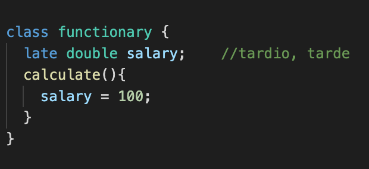
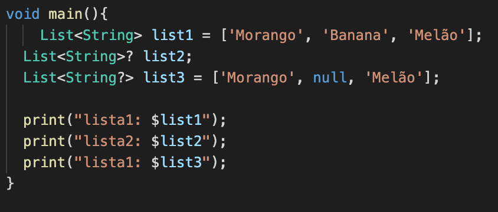

<h1>Null Safety</h1>

A partir do Dart 2.12, foi atribuído o Null Safety com a finalidade de facilitar as aplicações, dificultando os erros de valores nulos.  
Após o Null Safety todas as variáveis nunca poderão ser nulas, elas são “Non Nullable” por padrão. Com isso, para declarar que a variável possa ser nula em algum determinado momento da aplicação, utilizamos o operador “ ? “. Por exemplo:
 

Já o operador  “  !  “  é utilizado quando temos certeza de que uma variável que pode ser nula tem um valor naquele momento da aplicação, desse jeito é possível executar funções e atribuições envolvendo aquela variável.   Exemplo:

Obs: A variável " name " é do tipo que pode ou não receber um valor nulo, ao atribuir a variável “ resultName " que é do tipo não nulo, foi necessário atribuir o operador " ! ", pois assim estamos garantido ao Dart que este valor não é nulo, caso não fosse atribuído o operador " ! ", seria emitido um erro pelo analisador do Dart. Isso acontece, porque nessa situação, o analisador do Dart não consegue identificar que existe um valor na variável " name ", pois ela está fora da função. Caso a variável " name " realmente não tivesse nenhum valor, seria emitido um erro na execução do código, por isso só devemos atribuir o operador ‘ ! ‘ quando tivermos a certeza que o valor não será nulo.

<h3>Operador Late</h3>

O operador late declara que a variável é nula antes de ser inicializada, porém, nunca poderá atribuir nulo ao late. É utilizado para variáveis que precisam de algum processamento para inicializar. 
Ex:

<h3>Operador Null Aware Operator “ .? “
</h3>

O operador Null Aware Operator “  ?. “, basicamente ele verifica o objeto a esquerda, caso o objeto ‘list’ seja nulo, ele não executa o quem vem a sua direita “ .length ”, retornando um valor nulo.

<h3>Utilizando Null Safety numa lista</h3>

Na list1 está sendo atribuído valores, por isso não necessita utilizar o operador “ ? “. Já na list2, ao colocar o operador “ ? “ Na frente do objeto, estou dizendo ao Dart que toda a lista pode ou não receber valores nulo. Na list3, estou declarando ao Dart q o item da lista pode ser nulo, por isso o operador está na frente do tipo(String) da variável, pois se trata do item.

Também existe a possibilidade de utilizar o operador “ ?? “ para executar alguma ação caso o valor seja nulo, exemplo: 

<h3>Parâmetros Nomeados </h3>

Como parâmetros nomeados por padrão são opcionais, logo podemos colocar ou não o valor, dessa forma, no exemplo abaixo, se eu não passo nenhum valor, ele terá o seu segundo valor como nulo. Para solucionar esse problema, colocamos os parâmetros entre chaves e atribuímos a palavra-chave “ requidred “, assim definimos que os parâmetros são obrigatórios.

Mas se mesmo assim quiséssemos passar apenas um valor e deixar o segundo como opcional, basta atribuir o valor 0 ao segundo parâmetro. Ex: 

<h3>Type Promotion </h3>

No exemplo abaixo, ao utilizar o teste condicional "se txt for igual a nulo retorna 0", o Dart promoveu à variável “ txt “ para o tipo não nulo, isso acontece porque agora ele sabe que no “ text.length “ nunca receberá o valor não nulo.

Também é possível fazer uma promoção de tipo utilizando uma execeção, ao utilizar o “ throw “ o Dart entende que o valor de “ txt “ não chegará nulo no “ return txt.length “

Não podemos utilizar o Type Promotion com propriedades de atributos de uma classe, para isso é necessário utilizar uma variável 
de auxílio, no caso do exemplo abaixo, criei a variável “ name “ que é do tipo não nulo, e atribuí a ela a variável “ _name ” do tipo que pode ou não receber um valor nulo, dessa forma, a variável “ name “ pode ser verificada pelo analisador do Dart dentro do escopo do método, como foi feito um teste condicional, ela foi promovida pra não nulo, por isso o Dart entende que “ return.length “ é do tipo não nulo.

<h3>Inicialização de Variáveis Não Nulas </h3>

É possível atribuir o valor 0 a variável ‘ total ‘ para que ela seja inicializada como não nula. Recapitulando que, isso só acontece porque a variável está fora da função 
‘ main ‘ e o analisador do Dart não consegue interpretar se existe um valor ou não. 

Nas classes estáticas também teremos que definir um valor para que ela possa ser inicializada. Exemplo:

